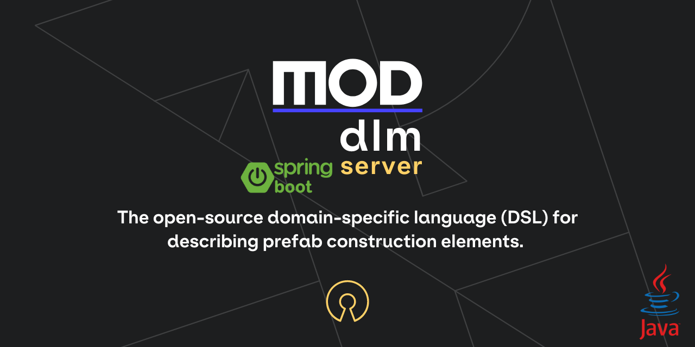

<div align="center">
    <a href="https://mod.construction/" target="_blank">
        
    </a>


# mod-dlm-spring-server

[](https://github.com/mod-construction/mod-dlm/actions/workflows/apidoc.yml)
[](https://github.com/mod-construction/mod-dlm/actions/workflows/publish.yml)
[](https://www.npmjs.com/package/@mod-construction/mod-dlm)
[](https://opensource.org/licenses/MIT)
</div>

**mod-dlm-server** is an open-source REST server for storing and querying element data described using the **[mod-dlm](https://github.com/mod-construction/mod-dlm)** domain-specific language (DSL).
This project provides tools for defining entity models and automatically generating CRUD APIs, enabling suppliers to create and manage catalogs of their products easily.

You can always find the most up-to-date API documentation here: [mod-dlm API Docs](https://mod-construction.github.io/mod-dlm/)


The server is generated automatically using the  [OpenAPI Generator](https://openapi-generator.tech).

- API version: 1.0.12
- Build date: 2025-06-03T12:37:58.764795587Z[Etc/UTC]
- Generator version: 7.14.0-SNAPSHOT
- Build package: org.openapitools.codegen.languages.SpringCodegen

## Requirements

Building the API client library requires [Maven](https://maven.apache.org/) to be installed.

## Installation

To install the API client library to your local Maven repository, simply execute:

```shell
mvn install
```

To deploy it to a remote Maven repository instead, configure the settings of the repository and execute:

```shell
mvn deploy
```

Refer to the [official documentation](https://maven.apache.org/plugins/maven-deploy-plugin/usage.html) for more information.

### Maven users

Add this dependency to your project's POM:

```xml
<dependency>
    <groupId>construction.mod</groupId>
    <artifactId>dlm-server</artifactId>
    <version>1.0.12</version>
    <scope>compile</scope>
</dependency>
```

### Gradle users

Add this dependency to your project's build file:

```groovy
compile "construction.mod:dlm-server:1.0.12"
```

### Others

At first generate the JAR by executing:

mvn package

Then manually install the following JARs:

* target/dlm-server-1.0.12.jar
* target/lib/*.jar
